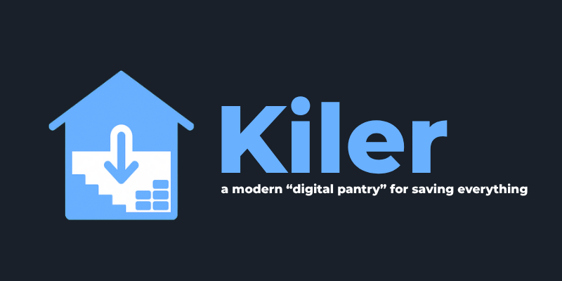
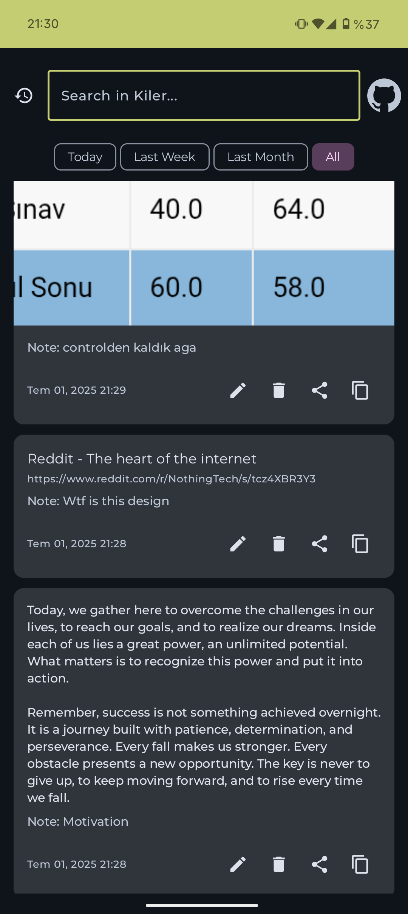
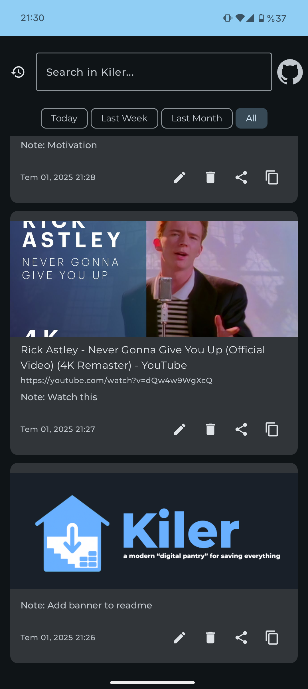
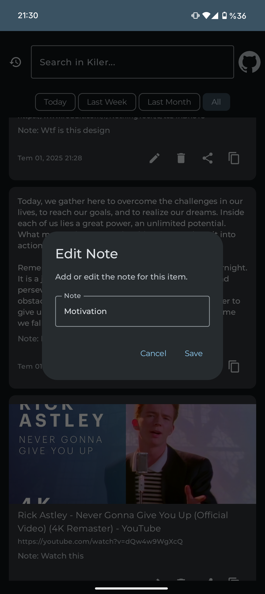
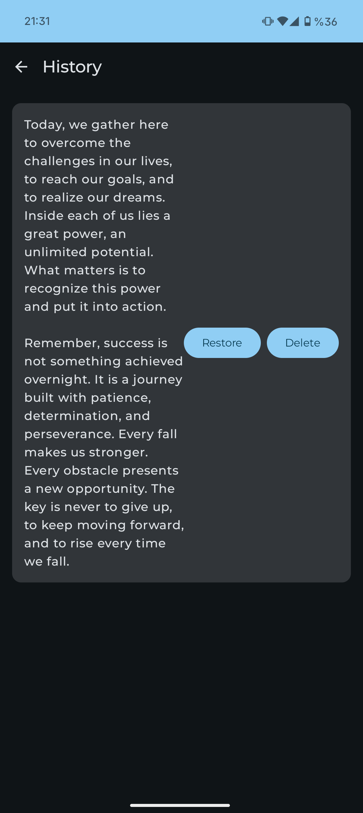

# Kiler - Your Digital Cellar

**Kiler** is a modern, minimalist "digital cellar" application for Android. It allows you to quickly save and archive various types of content—such as links, text snippets, and images—from any application on your device. With a focus on speed and a fluid user experience, Kiler is the perfect tool for organizing your digital life.

## ✨ Features

*   **Universal Save:** Save content from any app using the native Android "Share" menu.
*   **Smart Link Previews:** When you save a link, Kiler automatically fetches the page title and a preview image (only for youtube as of now).
*   **Image Archiving:** Save images directly to your Kiler archive for easy access.
*   **Powerful Search:** Quickly find any item in your archive with a real-time search function.
*   **Modern UI:** Built entirely with Jetpack Compose and Material 3, Kiler supports dynamic colors (Material You) for a personalized experience.
*   **Responsive Design:** The user interface is designed to adapt to various screen sizes and content types.
*   **Lightweight & Fast:** Kiler is designed to be a fast and efficient tool that doesn't get in your way.

## 📸 Screenshots

  |  |  | 

## 🚀 Usage

### Saving Content

The primary way to save content to Kiler is through the Android Share Sheet:

1.  In any app (like your browser, gallery, or a social media app), tap the **Share** button.
2.  Select **Kiler** from the list of applications.
3.  Kiler will process the content:
    *   **Links:** Fetches the page title and a preview image.
    *   **Images:** Saves the image directly to the app.
    *   **Text:** Saves the text snippet.
4.  A confirmation screen will appear, allowing you to add an optional note before saving the item to your archive.

### Managing Your Archive

Inside the app, you can manage all your saved items. Each item card provides several options:

-   **📝 Edit:** Add or change the note associated with an item.
-   **🔗 Share:** Share the content out to another application.
-   **📋 Copy:** Copy the link, text, or image to the clipboard.
-   **🗑️ Delete:** Permanently remove the item from your Kiler.

## 🤝 Contributing

Contributions are welcome! If you have a feature request, bug report, or want to contribute to the code, please feel free to open an issue or submit a pull request.

## 📄 License

This project is licensed under the MIT License - see the [LICENSE](LICENSE) file for details.
